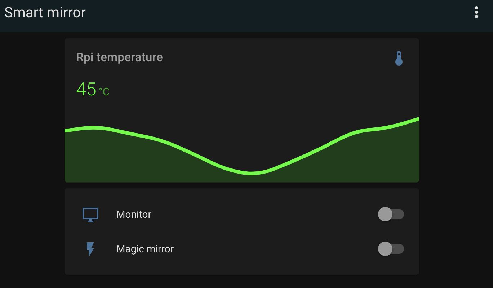

# HA Smart utility bash scripts
> This folder contains small and useful bash utilities scripts for controlling 
> the Magic Mirror, Rpi4 and monitor screen of your smart mirror. This is 
> useful when you want to control your smart mirror from a phone app and 
> integrate it with for instance home automation systems such as
> [Home Assistant](home-assistant.io/). Then you can automate control of smart mirror and get 
> better insight by setting up [Command line switch](https://www.home-assistant.io/integrations/switch.command_line/) 
> and [Command line sensor](https://www.home-assistant.io/integrations/sensor.command_line/).

## Home Assistant - dashboard


### Monitor off/on/status
```(bash)
# Turn off monitor
$ smartmirror_monitor_off.sh

# Turn on monitor
$ smartmirror_monitor_on.sh

# Monitor status
$ smartmirror_monitor_status.sh
```

### Magic Mirror start/stop/status
```(bash)
# Turn off monitor
$ smartmirror_pm2_mm_stop.sh

# Turn on monitor
$ smartmirror_pm2_mm_start.sh

# Monitor status
$ smartmirror_pm2_mm_status.sh
```

### Rpi4 Temperature
```(bash)
# Measure temperature of your Rpi4
$ smartmirror_rpi_temperature.sh
```